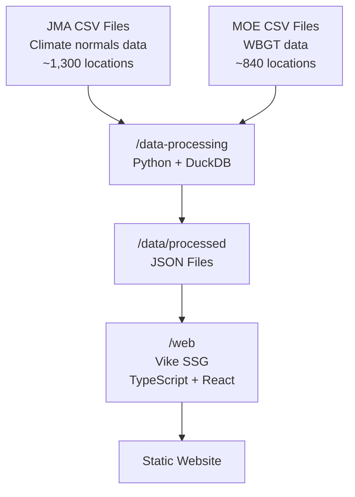

# Japan Climate Database

A website that analyzes, organizes, and visualizes historical weather data for Japan.

## Overview

This project processes weather data from Japanese governmental sources and presents it through an interactive web interface. The data includes temperature, precipitation, sunshine duration, and Wet Bulb Globe Temperature (WBGT) for approximately 1,300 locations across Japan.

## Architecture



## Directory Structure

```text
.
├── data/                    # Weather data files
│   ├── raw/                # Source CSV files from JMA and MOE (git-ignored)
│   └── processed/          # Generated JSON files
├── data-processing/        # Python scripts for data processing
└── web/                    # Web application (Vike + React)
```

### Components

- **[data-processing/](data-processing/)**: Python-based data pipeline that downloads and processes weather data
- **[web/](web/)**: React web application that visualizes the processed data

### Data Sources

- **JMA (Japan Meteorological Agency)**: Climate normals (2020 baseline) for temperature, precipitation, and sunshine duration
- **MOE (Ministry of the Environment)**: WBGT (Wet Bulb Globe Temperature) data for heatstroke prevention

## Quick Start

### 1. Data Processing

Process weather data from CSV to JSON format:

```bash
cd data-processing
uv sync
uv run download.py  # Download source data
uv run main.py      # Process data
```

See [data-processing/README.md](data-processing/README.md) for details.

### 2. Web Application

Run the website locally:

```bash
cd web
npm install
npm run dev
```

See [web/README.md](web/README.md) for details.
