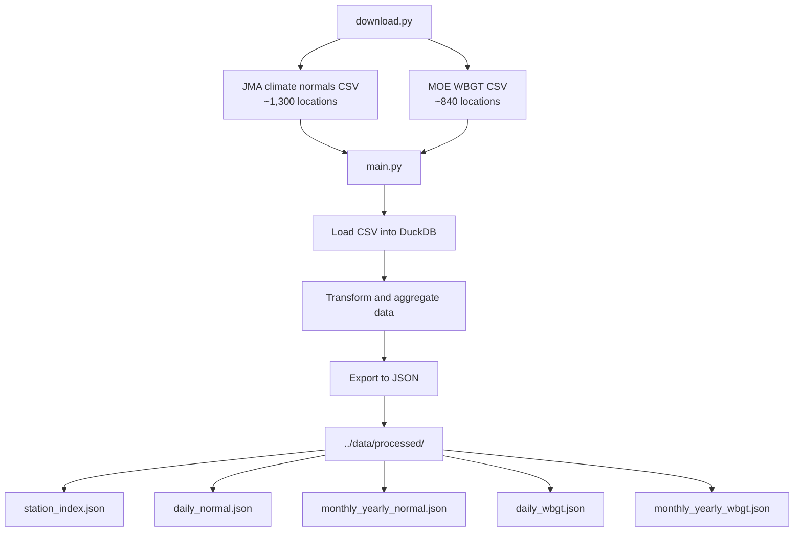

# Data Processing

Python-based data pipeline that downloads and processes weather data from Japanese governmental sources.

## Tech Stack

- **Python 3.12+**: Core runtime
- **DuckDB**: In-process SQL database for data transformation
- **Requests**: HTTP library for downloading source files
- **uv**: Fast Python package installer and manager
- **Ruff**: Linter and formatter

## Data Flow



## Directory Structure

```text
data-processing/
├── download.py          # Download CSV files from sources
├── main.py              # Main data processing pipeline
├── pyproject.toml       # Project dependencies
└── uv.lock              # Locked dependencies
```

## Setup

Install dependencies using uv:

```bash
uv sync
```

## Usage

### 1. Download Source Data

Download CSV files from JMA and MOE:

```bash
uv run download.py
```

Files are saved to `../data/raw/`.

### 2. Process Data

Transform CSV data into JSON:

```bash
uv run main.py
```

Processed JSON files are generated in `../data/processed/`.

## Output Files

| File | Description |
|------|-------------|
| `station_index.json` | Metadata for all weather stations (location, name, etc.) |
| `daily_normal.json` | Daily climate normals (temperature, precipitation, sunshine) |
| `monthly_yearly_normal.json` | Monthly and yearly climate normals |
| `daily_wbgt.json` | Daily WBGT values (April-October, past 5 years) |
| `monthly_yearly_wbgt.json` | Monthly and yearly WBGT values |

## Development

### Linting

```bash
uv run ruff check           # Check for issues
uv run ruff check --fix     # Auto-fix issues
```

### Formatting

```bash
uv run ruff format --check  # Check formatting
uv run ruff format          # Format code
